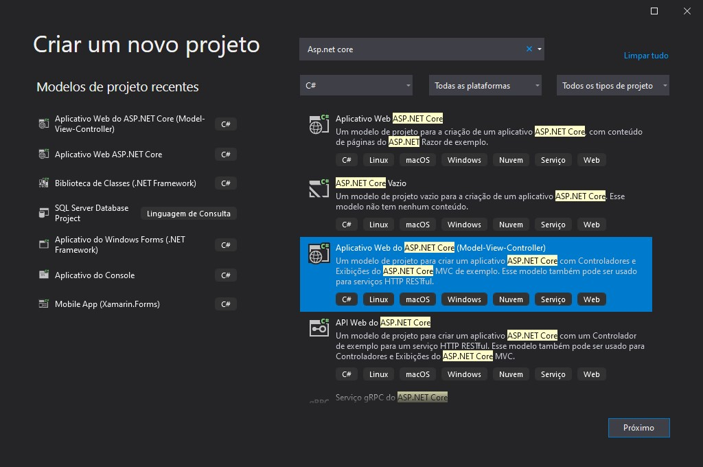

# [Asp.Net Core 5.0 & Vue JS From Zero to Hero 68 Hours Content](https://www.udemy.com/course/aspnet-core-50-vue-js-from-zero-to-hero-68-hours-content/)

Course Material

## Criando a solução

No Visual Studio, gerar uma solução `ASP .Net Core MVC`:



Via linha de comando `dotnet`, gerar uma solução `ASP .Net Core MVC`:

```shell
dotnet new mvc -n <name_to_the_project>
cd <name_of_the_project>
dotnet new sln -n <name_to_the_solution>
dotnet sln <name_of_the_solution> add <name_of_the_project>
dotnet new gitignore
```

## Simple Dinamic content on the pages

### ViewData simple example

No arquivo controller:

```csharp
ViewData["message1"] = "ViewData message";
```

No arquivo view:

```html
<h3>@ViewData["message1"]</h3>
```

### ViewBag simple example

No arquivo controller:

```csharp
ViewBag.message2 = "ViewBag message";
```

No arquivo view:

```html
<h3>@ViewBag.message2</h3>
```

### TempData simple example

No arquivo controller:

```csharp
TempData["message3"] = "TempData message";
```

No arquivo view:

```html
<h3>@TempData["message3"]</h3>
```

## Criando um novo arquivo Model

No Visual Studio, clicar com o direito na pasta `Model` e criar uma nova classe.
Ex:

```csharp
namespace Adonet_Blog.Models
{
    public class Person
    {
        public string Name { get; set; }
        public string Surname { get; set; }
    }
}
```

Instanciar a classe recém criada dentro do método `IActionResult` desejado do
arquivo de controller desejado. E passá-la como parâmetro de
`return View(<nome-da-instancia>)`. Ex:

```csharp
public IActionResult Index()
{
    Person person = new Person {
        Name = "Victor",
        Surname = "Almeida"
    };

    return View(person);
}
```

Declarar o model a ser usado no arquivo de view e acessar as propriedades.
Ex:

```html
@model Person
...
<h4>Name: @Model.Name</h4>
<h4>Surname: @Model.Surname</h4>
```

### Acessando propriedades de uma lista

Instanciar uma lista da classe recém criada dentro do método `IActionResult` desejado do
arquivo de controller desejado. E passá-la como parâmetro de
`return View(<nome-da-instancia>)`. Ex:

```csharp
public IActionResult Index()
{
    List<Person> persons = new List<Person>
    {
        new Person()
        {
            Name = "Victor",
            Surname = "Almeida"
        },
        new Person()
        {
            Name = "Caio",
            Surname = "Argolo"
        }
    };

    return View(persons);
}
```

Declarar o model a ser usado no arquivo de view e acessar as propriedades.
Ex:

```html
@model List<Person>
...
@foreach (var person in Model)
{
    <div>
        <h4>Name: @person.Name</h4>
        <h4>Name: @person.Surname</h4>
    </div>
}
```

## [Layout](https://docs.microsoft.com/en-us/aspnet/core/mvc/views/layout?view=aspnetcore-5.0)

Default é definido no arquivo `Views/Shared/_Layout.cshtml`. Para views com
custom layouts usar o decorator `Layout`, como em:

```html
@{
    Layout = null;
}
```

Exemplo de arquivo view usando um custom layout: Adonet-Blog/Views/Home/AboutUs2.cshtml