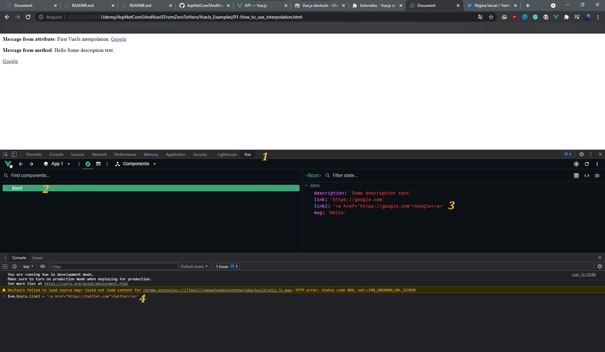

# [VueJs](https://vuejs.org/)

Pronunciation: "View Js"

### [Vue.js devtools](https://chrome.google.com/webstore/detail/vuejs-devtools/ljjemllljcmogpfapbkkighbhhppjdbg/related?hl=pt-BR) Browser Extension

[Reference](https://v3.vuejs.org/guide/installation.html#vue-devtools)



**Usage**:
1. Open the page Inspector and select the `Vue` table
2. Click to select the `Root`, so the `data` attributes will be shown
3. Find the `data` attribute you wish to change
4. Make the change to the `data` attribute on the `Console` commandline
   1. The `data` attributes can be accessed/changed as follows:
   ```js
    $vm.$data.link2 = '<a href="https://twitter.com">Twitter</a>'
   ```

## [Interpolation](https://v3.vuejs.org/guide/template-syntax.html#interpolations)

Used to create dinamic fields with pure Js.

```html
<span><b>Message from attribute</b>: {{ msg }}</span>
<p><b>Message from method</b>: {{ hello() }}</p>

<script>
    ...
    data: {
        msg: "First VueJs interpolation.",
        description: "Some description text.",
    },
    methods: {
        hello: function() {
            return `${this.msg} ${this.description}`;
        },
    },
    ...
</script>

```

## [V-Bind](https://v3.vuejs.org/api/directives.html#v-bind)

Used to set html tags attributes, like the value of the `href` for a link or the
value of the `src` of an image for example.

```html
<a v-bind:href="link">Google</a>

<script>
    ...
    data: {
        link: "https://google.com",
        ...
</script>
```

## [V-Once](https://v3.vuejs.org/api/directives.html#v-once)

Prevent alterations of an attribute value within an HTML tag marked with v-once.

```html
<!-- Shows the original attribute text -->
<span v-once><b>Message from attribute</b>: {{ msg }}</span>

<!-- Shows the method alterated text -->
<p><b>Message from method</b>: {{ hello() }}</p>

<script>
    ...
    data: {
        msg: "First VueJs interpolation.",
        description: "Some description text.",
        ...
    },
    methods: {
        hello: function() {
            this.msg = "Hello";
            return `${this.msg} ${this.description}`;
        },
    ...
</script>
```

## [V-HTML](https://v3.vuejs.org/api/directives.html#v-html)

Used to pass fully HTML tags dinamically. For example, send an interpolated
attribute to be used as a link that will be placed inside a HTML tag.

```html
<p v-html="link2"></p>

<script>
    ...
    data: {
        link2: '<a href="https://google.com">Google</a>',
    ...
</script>
```

## [V-ON](https://v3.vuejs.org/api/directives.html#v-on)

Used to capture event, for example `on click` event.

Prototype:
> `v-on:<event_name>="<method_to_be_called>"`

Short version:
> `@<event_name>="<method_to_be_called>"`

```html
<button v-on:click="DoThis">Click me</button>
<script>
    ...
        data: {
            number: 0,
        },
        methods: {
            DoThis: function() {
                this.number++;
                console.log(`Number value: ${this.number}`);
            },
            ...
    });
</script>
```

Can use parenteses if arguments are required:
> `v-on:<event_name>="<method_to_be_called>(<argument>)"`
> > `@<event_name>="<method_to_be_called>(<argument>)"`